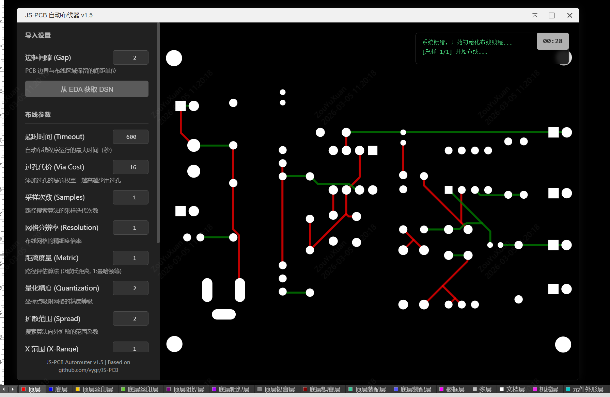

这是一个为嘉立创EDA专业版（JLCEDA Pro）开发的自动布线扩展插件，集成了开源项目 [JS-PCB](https://github.com/vygr/JS-PCB) 的布线引擎。

## 功能特性

- **一键布线**：自动获取当前 PCB 的 DSN 数据进行布线。
- **参数配置**：支持调整过孔代价、网格分辨率、采样次数等高级布线参数。
- **历史记录**：自动保存布线历史，支持导出历史版本的 SES 文件。

## 使用方法

1. 安装本扩展。
2. 打开 PCB 文档。
3. 点击顶部菜单：JSPCB - 自动布线
4. 在弹出的窗口中配置布线参数（或保持默认）。
5. 点击 **开始布线**。
6. 等待布线完成，点击 **导入 SES**。

## 已知局限性与贡献说明

由于 JS-PCB 引擎本身的算法特性限制，**当前的自动布线效果可能较为一般**，特别是对于元件密度较高或规则复杂的 PCB，可能会出现：
- 布通率较低，无法完成所有网络的连接。
- 走线路径不够优化，存在绕线或冗余过孔。
- 布线速度较慢或超时。

本项目的主要目的是**提供一个将自动布线器集成到 JLCEDA Pro 的技术框架与参考实现**。

我们非常欢迎社区开发者参与进来，基于此框架：
- 优化现有的布线参数配置逻辑。
- 改进底层布线算法。
- 引入或移植其他更强大的开源布线引擎。

希望能通过社区的力量，共同打造一个好用的开源自动布线扩展！

## 第三方开源组件说明

本项目在自动布线功能中移植并使用了以下第三方开源项目代码：

- **JS-PCB** (https://github.com/vygr/JS-PCB)
  - 许可证：GNU General Public License v2.0 (GPL-2.0)
  - 原始代码位置：`iframe/jspcb/` 目录下的核心逻辑文件（如 `router.js`, `worker.js`, `mymath.js` 等）。
  - 修改说明：
    - `iframe/jspcb/index.html`: 修改了 UI 布局和样式以适配 EDA 扩展风格。
    - `iframe/jspcb/main.js`: 增加了与 JLCEDA API 通信的胶水代码（DSN 获取与 SES 导入）。
    - 修复了在 IFrame 环境下 Worker 加载的跨域/安全问题。

**注意**：本扩展包遵循 GPL-2.0 协议分发。如果您分发本扩展包或其衍生作品，请确保遵守 GPL-2.0 的相关条款。
